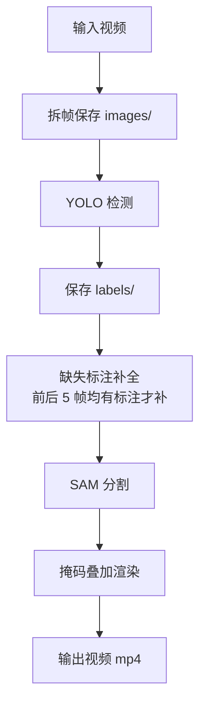

# detect-and-sam

本目录提供一个视频处理脚本：`detect_and_sam-1024.py`。它将视频拆帧后进行目标检测，再用 SAM 做分割并把掩码叠加到输出视频中。

## 程序逻辑说明

1. **拆帧**：把视频逐帧保存为 `images/000001.jpg` 这类文件。
2. **目标检测（YOLO）**：对每一帧推理并保存 YOLO 格式标注到 `labels/000001.txt`。
3. **缺失标注补全**：对空标注帧做补全，仅在前后 5 帧都存在有效标注时才复制前帧标注。
4. **分割与渲染（SAM）**：读取标注框，做 SAM 分割并把掩码按指定颜色与透明度叠加回原帧。
5. **输出视频**：生成带掩码的 MP4。

## 处理流程图



## 关键参数（在 `__main__` 配置）

- `conf` / `iou` / `imgsz` / `max_det` / `classes`：YOLO 检测参数。
- `max_split_frames`：拆帧上限，`-1` 表示全部。
- `num_sam_frames`：分割上限，`-1` 表示全部。
- `mask_color` / `mask_alpha`：掩码颜色和透明度（RGB）。

## 输出结构

```
<output_dir>/<时间戳>/
  images/      # 拆帧图片
  labels/      # YOLO 标注
  <视频名>_segmented.mp4  # 结果视频
```

## 使用说明（示例）

在 `__main__` 中配置路径和参数后运行：

```bash
python detect_and_sam-1024.py
```
